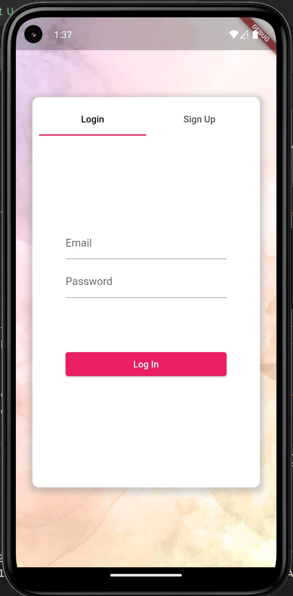
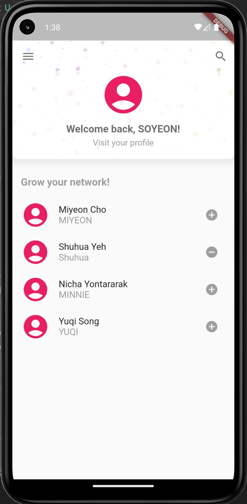
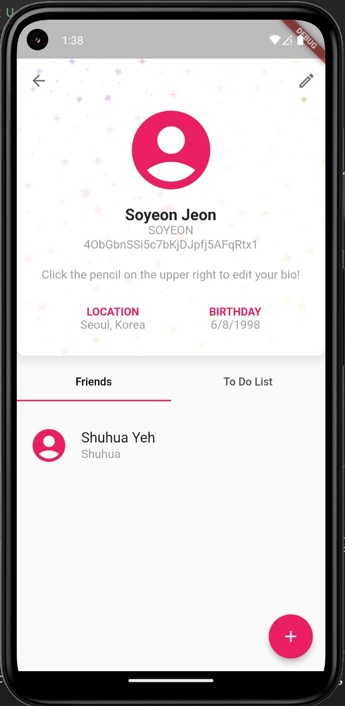
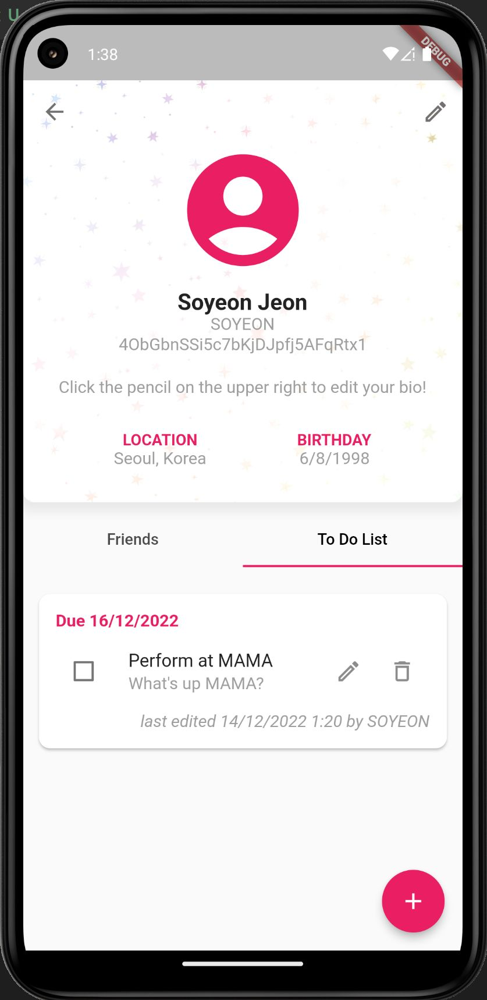
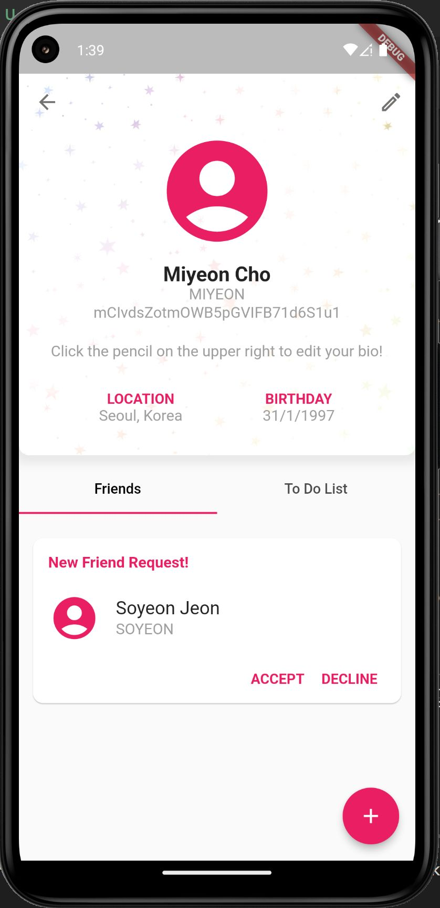
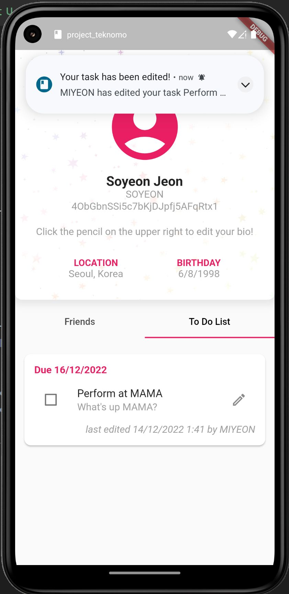

# Project: Shared Todo App

**Name:** Johanna Eikou Teknomo 
**Student Number:** 2019-07447 
**Section:** C-6L

# App/Program Description

This app is a shared todo app. You can login and sign up into the app to add, accept, decline, and unfriend friends, search for users that you might want to friend, and access your friends' tasks or create your own.

# Screenshots

# Things you did in the code

I mainly copy pasted the codes from my previous lab exercises, which were very helpful, and the code from Ma'am Kat's lecture video on notifications. I also worked the hardest on the UI for my app to have a pastel rainbow theme. I used different widgets that I've never used before, like the Card and TabBar.

For my friend list and todos, something I implemented differently from my previous exers was that I used a StreamBuilder to show it on the profile page so that whenever a new todo was added, or if a todo was edited or deleted, it would immediately show on the screen without having to go back a page first. I also allowed users to edit their bios and I was able to have it change on the screen immediately by using a StreamBuilder as well.

Another thing I implemented differently was the search page, which I got from a YouTube video. I mainly did it this way so that my UI would look nice, but I enjoyed implementing this because I was able to achieve filtering the list of users by typing a substring of their usernames or names.

# Challenges faced

The hardest part about this exer was using the StreamBuilder. Even though everything (literally every part of the project's functionality) could be copy pasted from the previous exers, I wanted to create an app with a really nice UI, and having the todos and friend list not appear immediately after changes have been made got me very annoyed, so I needed to use a StreamBuilder even though I'm not very familiar with its usage. It was really hard to get it to work alongside the TabBar, which I also wanted to implement because it looked nice, because I needed to filter out the snapshots retrieved by the StreamBuilder depending on the profile I'm looking at.

# Test Cases

## Happy Paths

The following are the happy paths in the code (minimum 2) which are tested in `app_test.dart`:

1. The user, when logging in, should type their correct email and password, and if successful, the user's username, along with "Welcome back", should appear at the top of the screen.
2. The user, when clicking on their profile, should be able to see their information at the top of the screen and a floating action button at the bottom of the screen.

## Unhappy Paths

The following are the unhappy paths in the code (minimum 2) which are tested in `app_test.dart`:

1. An error should appear when a user tries to change the status of a task that isn't theirs.
2. The user should sign up with a password that's at least 8 characters with at least a number, a special character, and an uppercase letter, and a lowercase letter.

# References

- https://stackoverflow.com/questions/52458555/how-i-can-view-floatingactionbutton-on-condition
- https://stackoverflow.com/questions/54669630/flutter-auto-size-alertdialog-to-fit-list-content
- https://stackoverflow.com/questions/53216169/multiple-text-fields-in-a-row-with-padding
- https://stackoverflow.com/questions/52160746/flutter-appbar-background-image
- https://stackoverflow.com/questions/54241753/background-image-for-scaffold
- https://stackoverflow.com/questions/52227846/how-can-i-add-shadow-to-the-widget-in-flutter
- https://stackoverflow.com/questions/61283786/how-do-i-switch-to-the-another-tab-screen
- https://api.flutter.dev/flutter/material/TabBar-class.html
- https://stackoverflow.com/questions/50566868/how-to-change-background-color-of-tabbar-without-changing-the-appbar-in-flutter
- https://stackoverflow.com/questions/51089994/flutter-setting-the-height-of-the-appbar
- https://stackoverflow.com/questions/49015038/removing-the-drop-shadow-from-a-scaffold-appbar-in-flutter
- https://stackoverflow.com/questions/66835173/how-to-change-background-color-of-elevated-button-in-flutter-from-function
- https://stackoverflow.com/questions/51778266/digit-only-textformfield-in-flutter
- https://www.educative.io/answers/how-to-cast-a-string-to-an-integer-in-dart
- https://hesam-kamalan.medium.com/how-to-prevent-the-keyboard-pushes-a-widget-up-on-flutter-873569449927
- https://www.flutterbeads.com/change-drawer-icon-in-flutter/#Steps-to-Change-Drawer-Icon-in-Flutter
- https://stackoverflow.com/questions/47435231/open-drawer-on-clicking-appbar
- https://stackoverflow.com/questions/57941227/how-to-add-icon-to-appbar-in-flutter
- https://stackoverflow.com/questions/68487417/why-do-people-put-tabcontroller-inside-initstate-when-putting-it-inside-widget-b
- https://stackoverflow.com/questions/44179889/how-do-i-set-background-image-in-flutter
- https://medium.com/ariel-mejia-dev/make-an-image-with-opacity-layer-in-flutter-fca77e453731
- https://www.fluttercampus.com/guide/208/get-timestamp-dart/
- https://stackoverflow.com/questions/61339661/flutter-how-to-dispose-textcontroller
- https://stackoverflow.com/questions/45900387/multi-line-textfield-in-flutter
- https://stackoverflow.com/questions/48895195/how-can-we-change-the-width-padding-of-a-flutter-dropdownmenuitem-in-a-dropdown
- https://stackoverflow.com/questions/51498911/flutter-keyboard-overflow-with-my-dialog
- https://stackoverflow.com/questions/71159466/how-to-skip-an-index-in-an-listview-flutter
- https://stackoverflow.com/questions/49959617/flutter-how-do-you-make-a-card-clickable
- https://api.flutter.dev/flutter/widgets/GestureDetector-class.html
- https://www.youtube.com/watch?v=Xinjf7AQUYA
- https://stackoverflow.com/questions/50542771/stream-builder-from-firestore-to-flutter
- https://www.folkstalk.com/2022/09/how-to-give-width-based-on-screen-size-flutter-with-code-examples.html
- https://www.youtube.com/watch?v=Yrq2llD2Ldw
- https://romannurik.github.io/AndroidAssetStudio/
